<p align="center">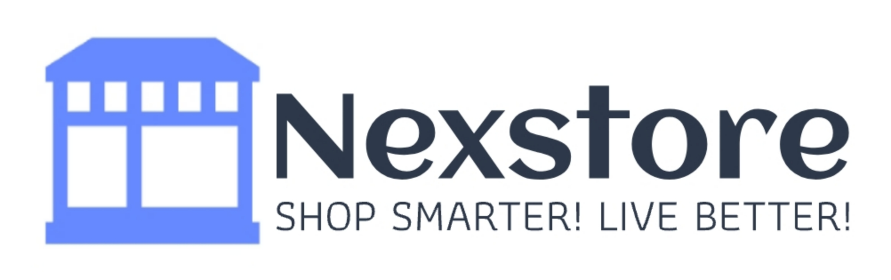</p>


Nexstore is a cutting-edge e-commerce website designed to provide a seamless shopping experience. Our platform offers a wide range of products divided into 8 categories, ensuring you can easily find what you need. With user-friendly features like filtering, sorting, favorites, and a robust cart system, Nexstore makes online shopping effortless and enjoyable.

### Key Features
- Browse Products by Category: Explore products across 8 distinct categories. Filter products based on categories like Best Sellers or sort them according to price.
- Detailed Product Views: Click on any product to view detailed information, including images, descriptions, and pricing.
- Favorites: Add products to your favorites for quick access and easy reference later.
- Cart Functionality: Add products to your cart, view cart contents, and proceed to checkout smoothly.
- Order Management: Once an order is placed, you can view, track, or cancel your orders from your profile section.

### Highlights
- Application built from 0 to 1 (No public API's have been used)
- Self implemented UI brewing little inspiration from random sources, focusing on smoother user experience 


### Technical Highlights
- Readable and Maintainable Code: Our codebase follows best practices, making it easy to read, maintain, and extend.
- Responsive Design: All pages are designed with responsiveness in mind, providing a consistent experience across desktops, tablets, and mobile devices.
- Server and Client Components: Nexstore utilizes the power of Next.js with both server and client components to optimize rendering and improve performance. Server-side rendering (SSR) ensures that pages load quickly and are SEO-friendly, while client-side components enable dynamic interactions and real-time updates.
- Performance Optimization: The application uses lazy loading, and efficient data fetching techniques to minimize load times and enhance the user experience.

## A sneak peek into what we have here!

Visit my website at: https://nex-store-sigma.vercel.app/


## Technology Stack

- **Coding Languages**:   

- **Tools & Frameworks**: 
 


- **Project Management Tools**:  

<hr>

### Flow of the Application

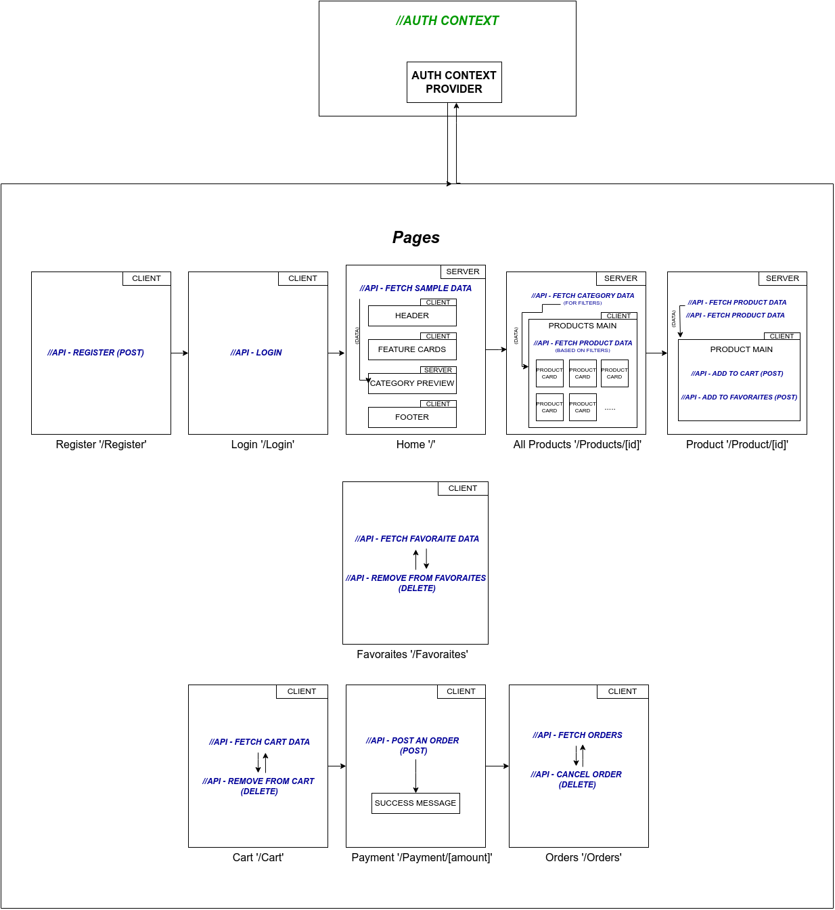

### Home Page

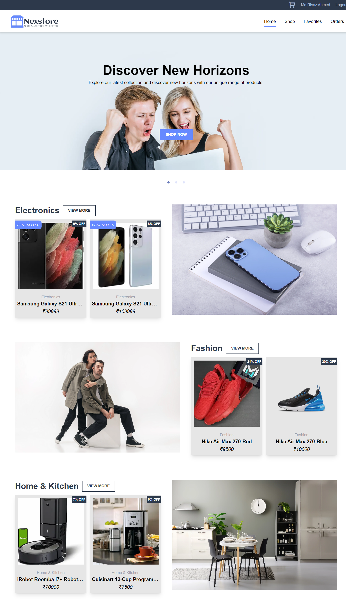

### Login Page

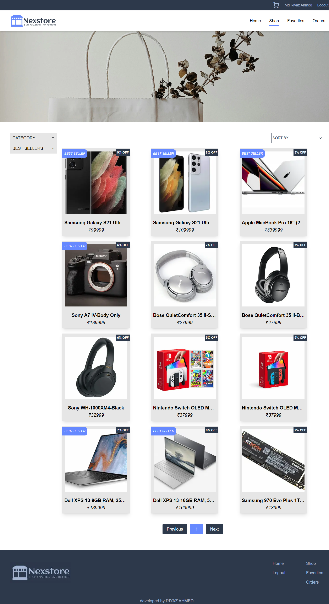

### Login Page

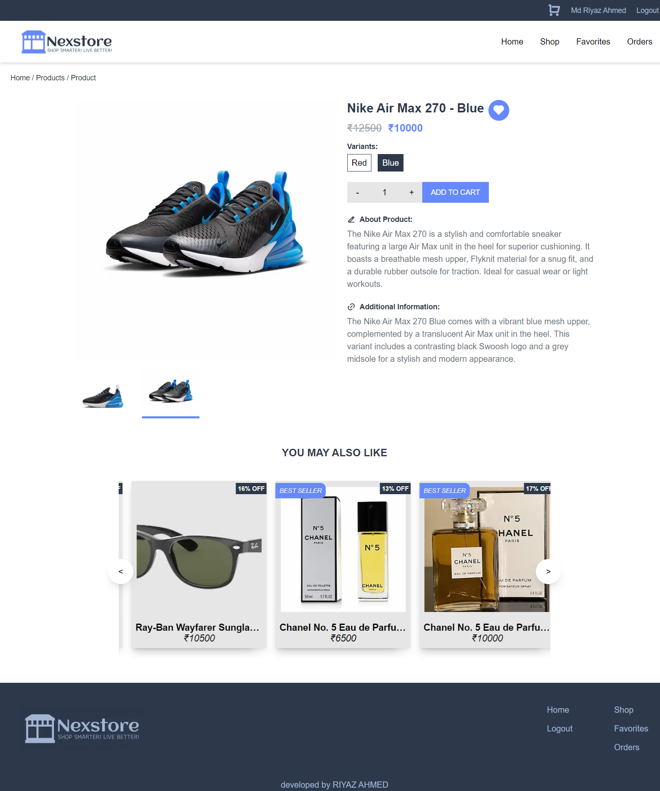

### Login Page

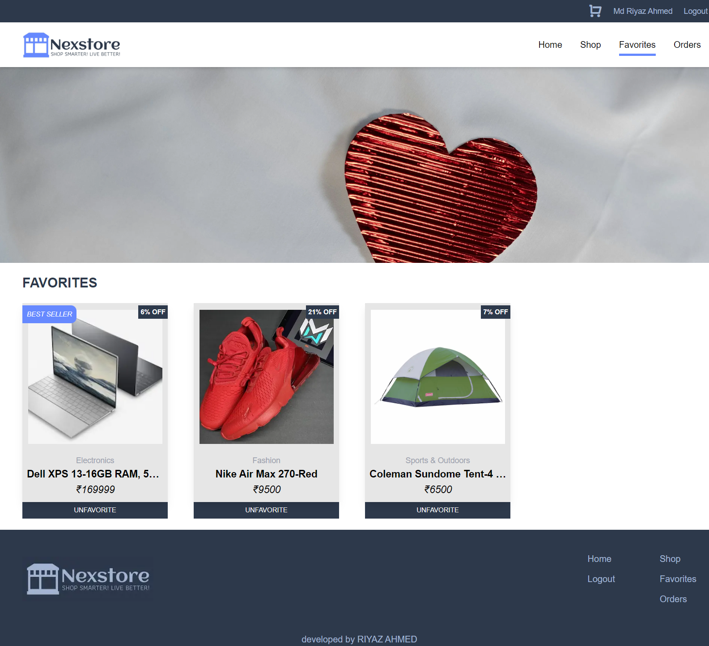

### Login Page

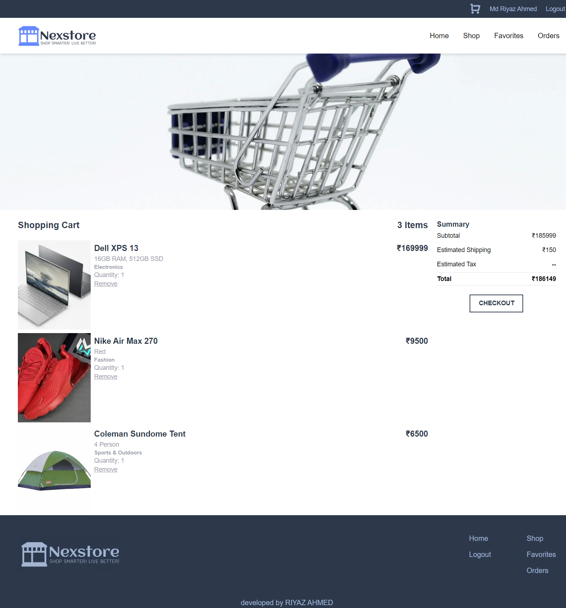

### Login Page

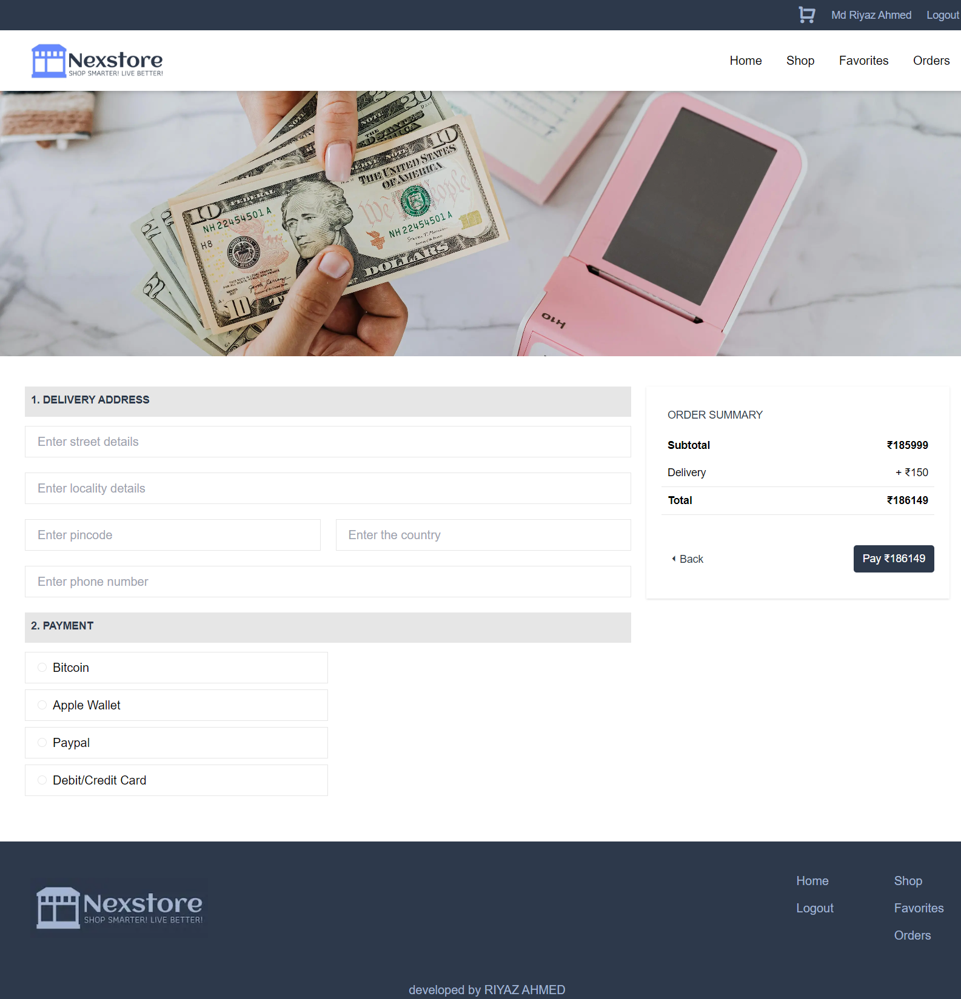

### Login Page

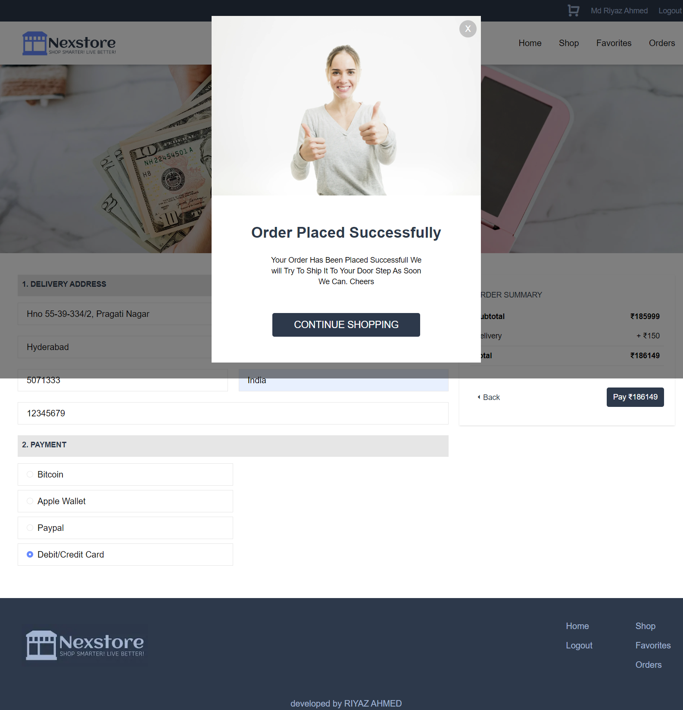

### Login Page

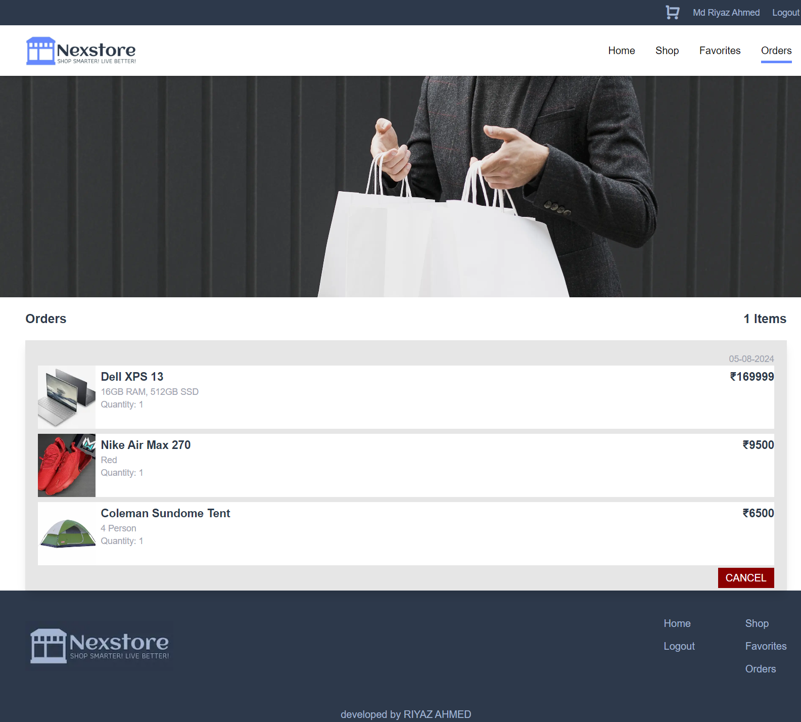

### Login Page

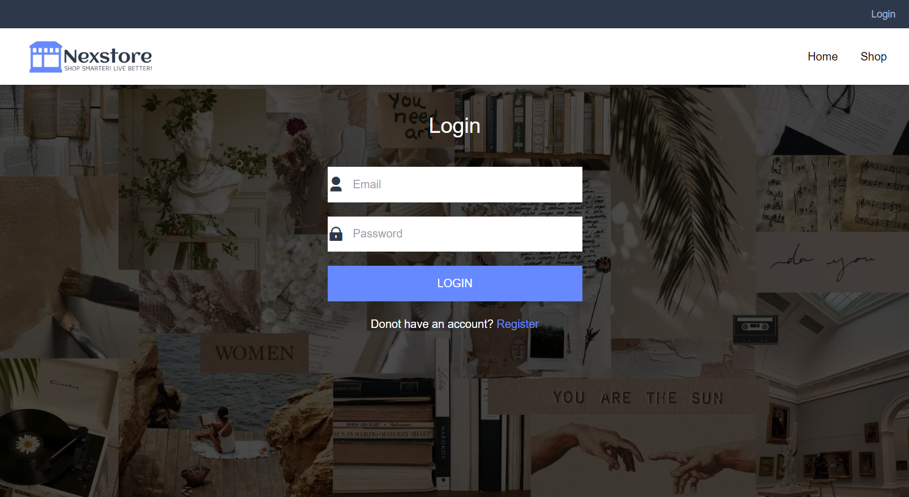


## Environment Setup for local use-

- Drop a :star: on the GitHub repository.
  <br/>

- Download and install a code/ text editor. - Recommended- - [Download VS Code](https://code.visualstudio.com/download) 
  <br/>

- Download [Node Js and npm(Node package manager)](https://nodejs.org/en/) (when you install Node, npm also gets installed by default)
  <br/>


- Download and extract the github repositor
<br/>

- Open the project (NexStore-main) using VS Code
  <br/>

- Open a new terminal and enter `cd frontend` to navigate to the front end of the project
<br/>

- Run this command to install all dependencies for the frontend of this project.

```
npm install
```

<br/>

- Now run this command to start the project.

```
npm start
```
<br/>

- Now you are all set to use this project.

## Developer

- Md Riyaz Ahmed