
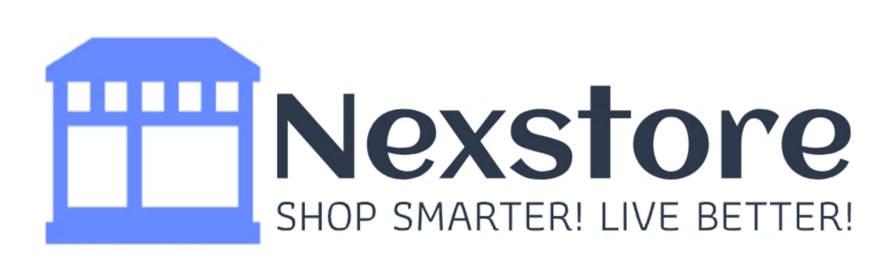

<h1 style="border-bottom: none; margin-bottom: 0;">
  Nexstore - An Implementation of a basic e-commerce web application
</h1>

Hoasted at: https://nex-store-u6lz.vercel.app/

NexStore, a full-stack e-commerce platform enabling seamless product discovery, filtering, favorites, cart, and order management across different product categories.

### Features
- Browse Products by Category: Explore products across 8 distinct categories. Filter products based on categories like Best Sellers or sort them based on price.
- Detailed Product Views: Click on any product to view detailed information, including images, descriptions, and pricing.
- Favorites: Add products to your favorites for quick access and easy reference later.
- Cart: Add products to your cart, view cart contents, and proceed to checkout smoothly.
- Order Management: Once an order is placed, you can view, track, or cancel your orders from your profile section.

### Highlights
- Application built from 0 to 1 (No public API's have been used)
- Readable and Maintainable code
- Followed best coding practices to maintain high code quality and adhere to industry standards.
- Self implemented UI, focusing on smoother user experience 
- Responsive design principles are applied to every page throughout the website

### Technical Highlights
- Server and Client Components: Nexstore utilizes the power of Next.js with both server and client components to optimize rendering and improve performance. Server-side rendering (SSR) ensures that pages load quickly and are SEO-friendly, while client-side components enable dynamic interactions and real-time updates.
- Utilized Next's new App router and Image
- Performance Optimization: The application uses lazy loading, and efficient data fetching techniques to minimize load times and enhance the user experience.

## Version history

### v2 (current)
Whats new?
- Migrated the backend code from express.js to Springboot
- secure token based authentcation
- Introduction of MobX
- use of memoization techniques in the frontend
- implemented loader states (both full page and component level)
- Modular backend code strucutre 
- Global exception handling
- Swagger Documentation of the endpoints
- standard reposiory folder and component structure
- Minor UI modifications

### v1 
- Implemented a basic backend using Express.js by connecting to MongoDB database
- In application storage and management of images (using multer)
- Built the frontend using Next, Tailwind, CSS, and Redux 

## A sneak peek into what we have here!

### Flow of the Application

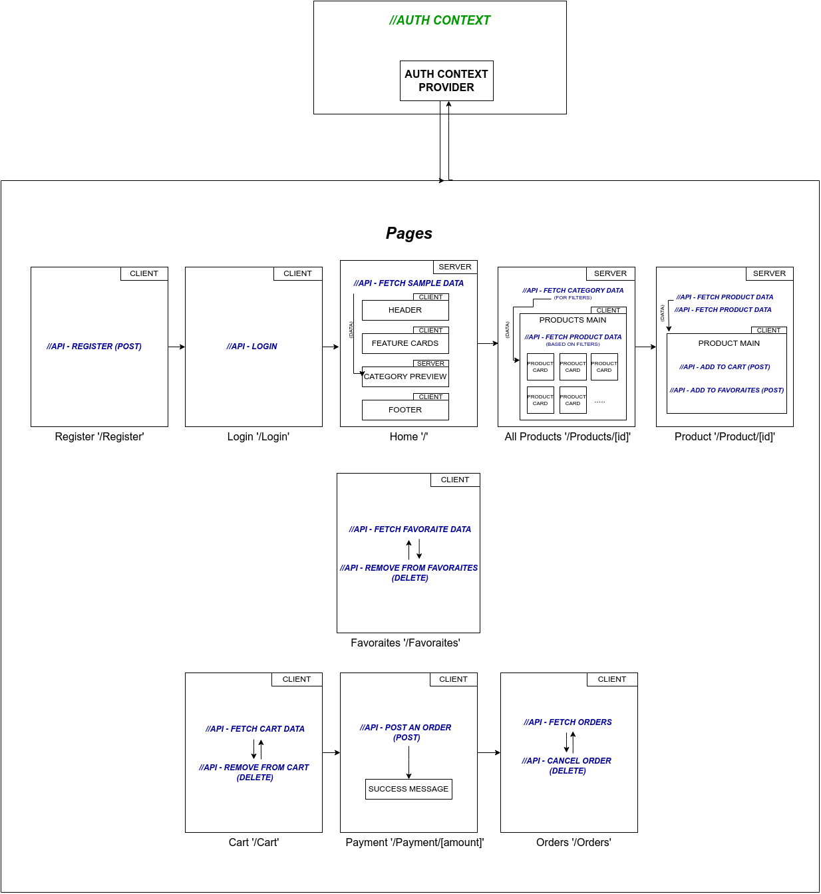

### Home Page

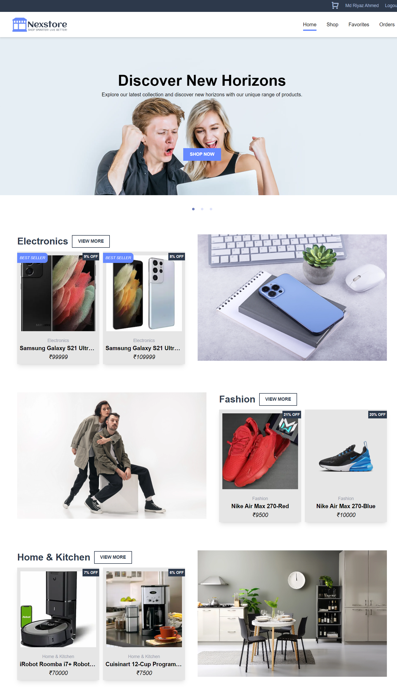

### Login Page

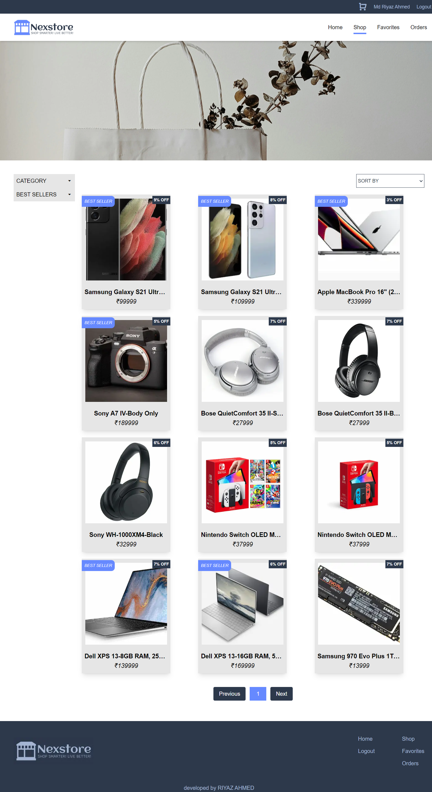

### Login Page

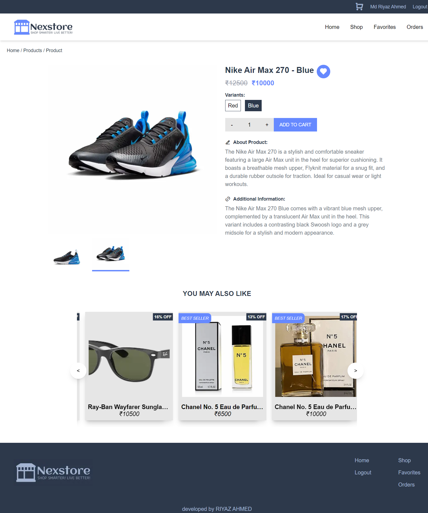

### Login Page

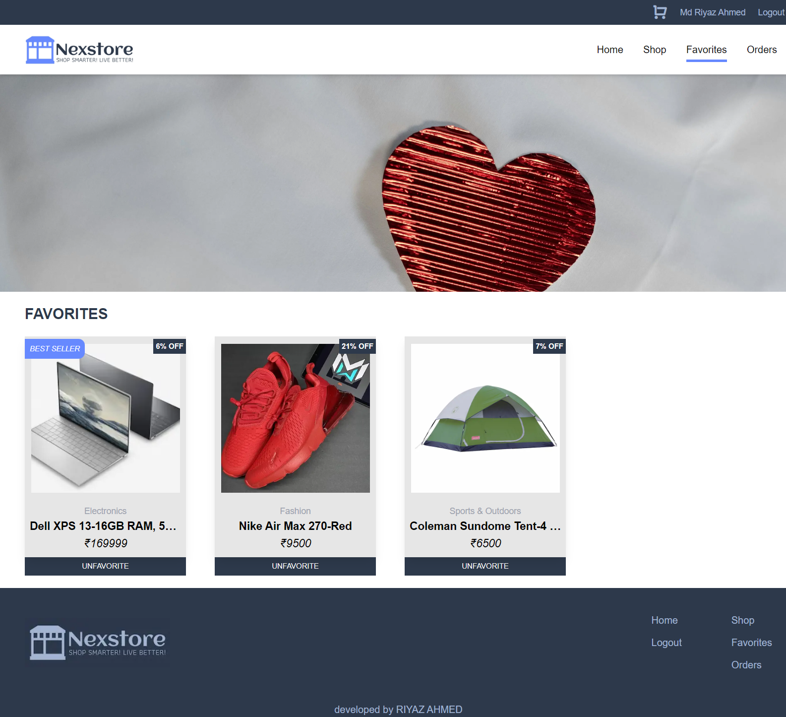

### Login Page

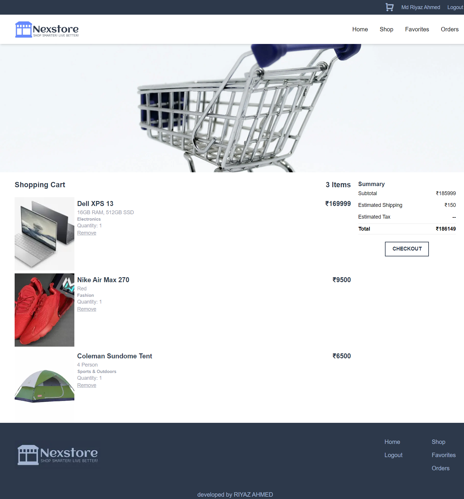

### Login Page

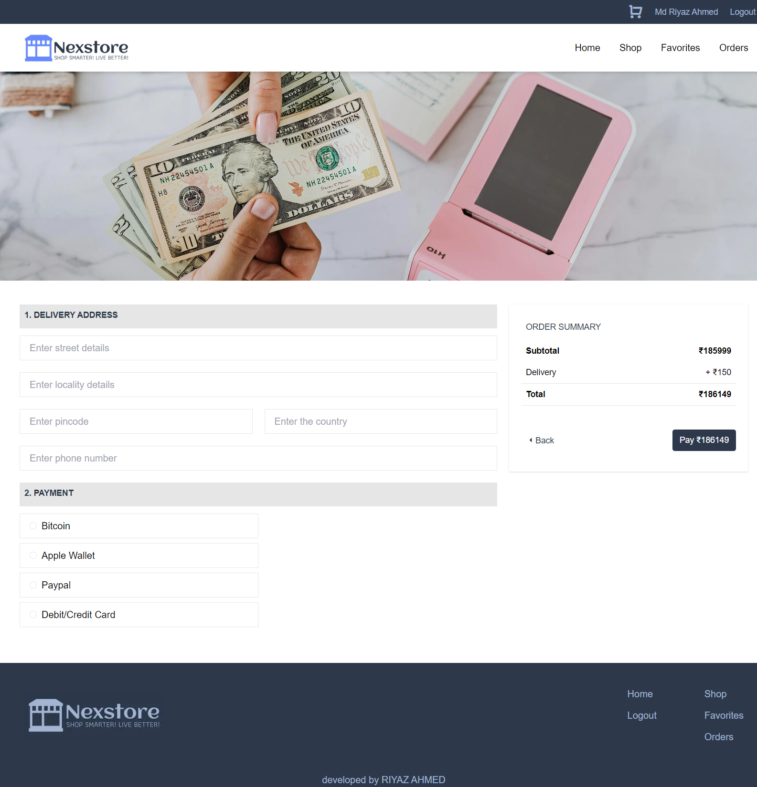

### Login Page

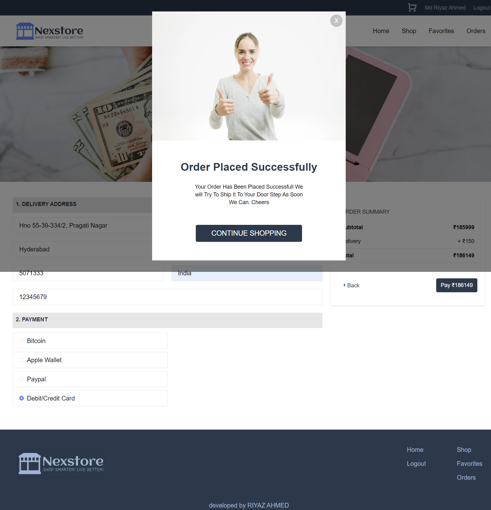

### Login Page

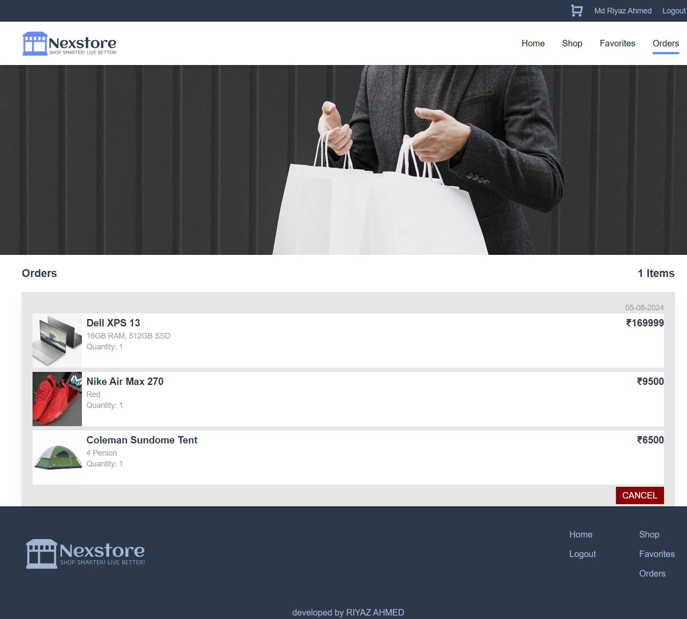

### Login Page

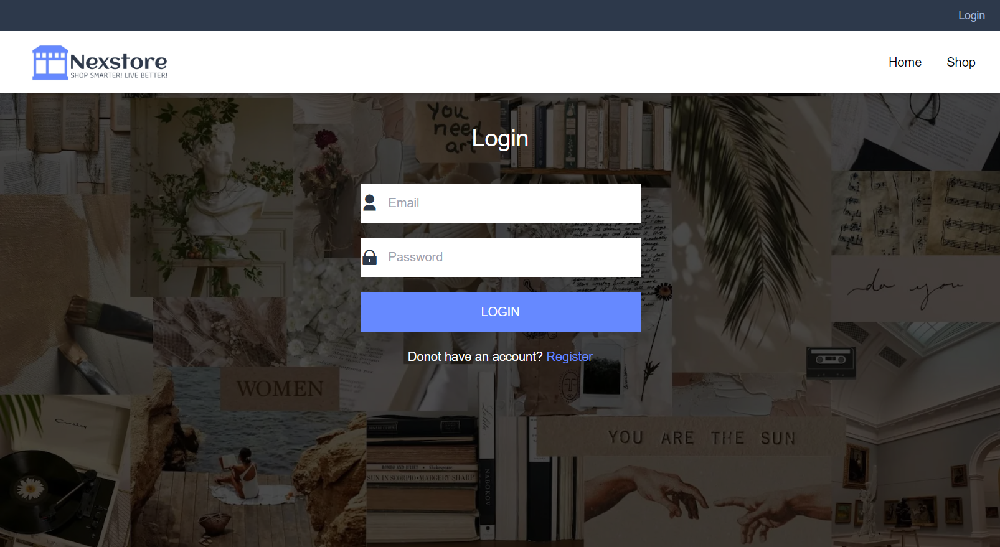

## Technology Stack

**Coding Languages**: 
 
  

**Tools & Frameworks**: 
 
    

**Project Management Tools**: 
 
 

## Developer

- Md Riyaz Ahmed